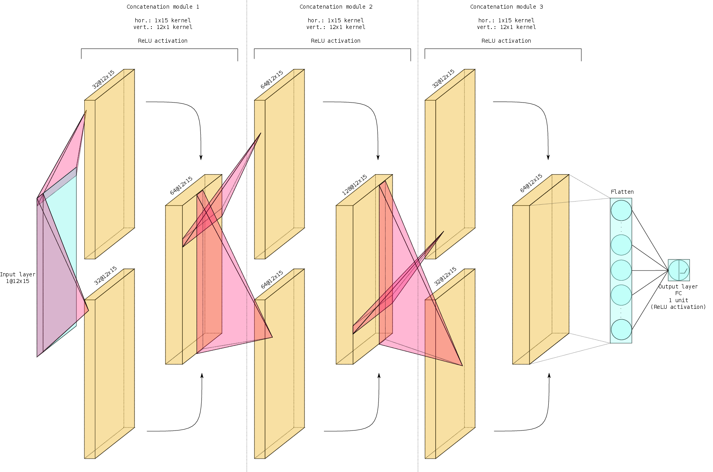

**Harold Erbin** and **Riccardo Finotello**

_Physics Department, Università degli Studi di Torino_ and _I.N.F.N. - sezione di Torino_

[Via Pietro Giuria 1, I-10125 Torino, Italy](https://goo.gl/maps/XxvAmhe2wUzxvhz66)

## Abstract

We consider a machine learning approach to predict the **Hodge numbers** of **Complete Intersection Calabi-Yau (CICY) 3-folds** in the framework of String Theory using two different sets of data: a first [dataset](http://dx.doi.org/10.1088/0264-9381/6/2/006) containing the configuration matrices of 7890 CICY manifolds (this is the _original dataset_) and a dataset (the _favourable dataset_) containing their [favourable](http://arxiv.org/abs/1708.07907) embedding (at least for most of them).

## Methodology

We start from the **exploratory data analysis** to study distribution of data, patterns, correlations and prepare the dataset for the analysis. In this section we do not perform statistical inference but we notice reproducible patterns and key points used in the following analysis.

We then perform a **machine learning** prediction analysis using several algorithms: we point out pros and cons of each of them, and we discuss the theory behind them and how it can help in improving the results. We use **Bayes statistics** for hyperparameter optimisation.

Among the algorithms presented we use several **linear algorithms** and **support vector machines** as well as **decision trees** algorithms. We then implement our version of **neural networks** which are able to improve the final accuracy by more than 25% on the best result obtained with the previous algorithms (we obtain 72% of accuracy using the Gaussian _kernel trick_ in the SVM regressor and 99%+ with the neural networks).

The choice of the architecture of the neural networks was driven by considerations typical of **computer vision** and **object recognition**. We use _convolutional neural networks_ to "automatically" build features necessary for inference of the **Hodge numbers**: we took inspiration from both the classical [LeNet](https://en.wikipedia.org/wiki/LeNet) originally developed by Y. LeCun in 1998 to which we changed the kernel and used a larger version, and the more modern [Inception Network](https://arxiv.org/pdf/1409.4842.pdf) developed by Google. In the last case we considered different convolutions (over rows and columns of the configuration matrix of the CICY manifolds) and concatenated the results found by two concurrent networks: the results reached almost **100% in test accuracy**, missing the prediction of only 4 manifolds over more than 780 samples.

## Description of the Files

The analysis is divided into different [_Jupyter_](https://jupyter.org/) notebooks (in this example list, hyperlinks return the version for the _original dataset_):

- the [_preanalysis_](cicy3o_preanalysis.ipynb) contains a detailed visual analysis of the dataset with outliers detection, clustering and PCA performance comparison, feature engineering and features selection,
- the [_classical analysis_](cicy3o_ml.ipynb) deals with the more "classical" approach of machine learning using linear regression models, support vector machines and decision trees,
- the [_ConvNet analysis_](cicy3o_nn.ipynb) uses **convolutional neural networks** to build the appropriate architecture to predict the Hodge numbers starting from the configuration matrix of the manifold,
- the [_transfer learning analysis_](cicy3o_nn_transfer-learning.ipynb) applies a more refined architecture to the feature engineered set using **transfer learning** from the previous convolutional models,
- the [_stacking analysis_](cicy3o_stack.ipynb) is an attempt at stacking ensemble learning to improve the results of the previous analysis.

Each [IPython](https://ipython.org/) notebook is entirely independent and can be run separately. The only real requirement is to first run (at least once) the _preanalysis_ notebook to generate the "analysis-ready" dataset.

Notice that there are several versions of _apparently_ the same notebooks: those named _cicy3o_... refer to the original dataset, while _cicy3f_... to the dataset with **favourable** embeddings. We also present data for the original dataset using only [half of the training set](cicy3o_ml_half_training.ipynb) and the prediction of the [logarithm of the second Hodge number](cicy3o_nn_logh21.ipynb) using neural networks.

## Installation Prerequisites

In order to run the analysis you will need a _Jupyter_ installation (we used an [_Anaconda_](https://anaconda.org/) environment) using **Python 3.6** at least. Moreover you will be required to install the following packages:

- [_Matplotlib_](https://matplotlib.org/)
- [_Numpy_](https://numpy.org)
- [_Pandas_](https://pandas.pydata.org/)
- [_PyDot_](https://pypi.org/project/pydot/)
- [_Scikit-learn_ (< 0.23)](https://scikit-learn.org/)
- [_Scikit-optimize_ (>= 0.7.4)](https://scikit-optimize.github.io/stable/)
- [_Scipy_](https://www.scipy.org/)
- [_Seaborn_](https://seaborn.pydata.org/index.html)
- [_Tensorflow (>= 2.0.0)_](https://www.tensorflow.org/)

